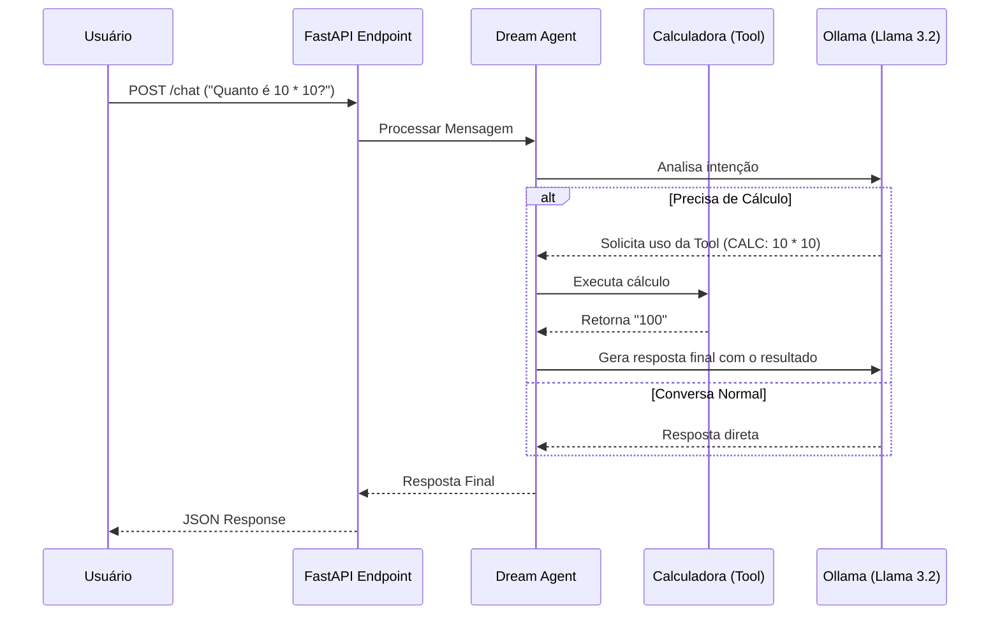

# 🧠 DreamSquad AI Agent Challenge

Este projeto implementa uma API de Chat inteligente utilizando **FastAPI** e um Agente de IA local (via **Ollama**) capaz de decidir autonomamente quando utilizar ferramentas externas (Calculadora).

Desenvolvido como parte do processo seletivo para a DreamSquad.

## 🚀 Tecnologias Utilizadas

- **Python 3.10+**
- **FastAPI:** Framework web moderno e de alta performance.
- **Ollama:** Para execução de LLMs (Large Language Models) localmente.
- **Strands Agents SDK (Simulado):** Orquestração do agente.
- **Pydantic:** Validação de dados e settings management.

## 📂 Arquitetura do Projeto

O projeto segue princípios de **Clean Architecture** para garantir escalabilidade e fácil manutenção:

```text
dream-agent-api/
├── app/
│   ├── __init__.py
│   ├── main.py             # Ponto de entrada da aplicação (FastAPI app)
│   ├── api/
│   │   ├── __init__.py
│   │   └── routes.py       # Definição do endpoint /chat
│   ├── core/
│   │   ├── __init__.py
│   │   └── config.py       # Carregamento de variáveis de ambiente (.env)
│   ├── agent/
│   │   ├── __init__.py
│   │   ├── engine.py       # Configuração do Agente Strands e conexão com Ollama
│   │   └── tools.py        # A lógica da Tool de Cálculo Matemático
│   └── schemas/
│       ├── __init__.py
│       └── chat.py         # Modelos Pydantic (Input/Output JSON)
├── .env                    # Chaves e configurações (NÃO SOBE PRO GIT)
├── teste_conexao.py
├── teste_api.py
├── .gitignore              # Arquivos ignorados 
├── requirements.txt        # Dependências do projeto 
└── README.md               # Instruções de uso
```
## 🔄 Fluxo de Dados
O diagrama abaixo ilustra como o Agente decide entre responder diretamente ou usar a ferramenta de cálculo:



## ⚙️ Pré-requisitos
* Python 3.10 ou superior instalado.

* Ollama instalado e rodando.

Configuração do Ollama (Obrigatório). 
O projeto depende do modelo llama3.2. 

Execute no seu terminal:
```bash
# 1. Baixe e instale o Ollama em [https://ollama.com/](https://ollama.com/)
# 2. No terminal, baixe o modelo:
ollama run llama3.2
# 3. Mantenha o serviço do Ollama rodando em segundo plano.
```

## 🛠️ Instalação e Execução

1. Clone o repositório (ou extraia os arquivos)
```bash
git clone https://github.com/skyzinha-chan/dream-agent-api.git
cd dream-agent-api
```

2. Crie o Ambiente Virtual
```bash
# Windows
python -m venv venv
.\venv\Scripts\activate

# Linux/Mac/Git Bash
python -m venv venv
source venv/bin/activate (ou source venv/Scripts/activate no Git Bash)
```

3. Instale as Dependências
```bash
pip install -r requirements.txt
```

4. Configure as Variáveis de Ambiente
Crie um arquivo .env na raiz do projeto com base no exemplo abaixo:
```text
PROJECT_NAME="DreamSquad AI Agent"
VERSION="1.0.0"
OLLAMA_BASE_URL="http://localhost:11434"
OLLAMA_MODEL="llama3.2"
```

5. Execute a API
```bash
uvicorn app.main:app --reload
```
Acesse a documentação automática (Swagger) em: http://localhost:8000/docs


## 🧪 Como Testar
Você pode testar usando o Swagger UI (/docs) ou via cURL:

Cenário 1: Conversa Geral
```bash
curl -X POST "http://localhost:8000/chat" \
     -H "Content-Type: application/json" \
     -d '{"message": "Quem foi Albert Einstein?"}'
```

Cenário 2: Uso de Tool (Cálculo) O agente identificará a necessidade matemática e usará a tool calculate_tool.
```bash
curl -X POST "http://localhost:8000/chat" \
     -H "Content-Type: application/json" \
     -d '{"message": "Quanto é 1234 * 5678?"}'
```